# AWS IAM + S3 Security Lab

**Laboratório prático de Cloud Security na AWS**, com foco em gerenciamento de identidades, autenticação multifator (MFA), controle de acesso ao Amazon S3, validação de permissões e governança de custos.

> **Escopo:** ambiente educacional criado para praticar controles de segurança. Os resultados refletem as configurações e verificações realizadas no laboratório, não uma auditoria completa de uma conta de produção.

## Objetivos

- Criar identidades IAM com responsabilidades distintas.
- Habilitar MFA para reduzir o risco de acesso indevido.
- Aplicar e testar o princípio do menor privilégio (*Least Privilege*).
- Diferenciar acesso a metadados de buckets S3 do acesso ao conteúdo dos objetos.
- Utilizar o IAM Policy Simulator para verificar decisões de autorização.
- Configurar o IAM Access Analyzer para avaliar acesso externo.
- Definir um orçamento e alertas de custos no AWS Budgets.

## Serviços e conceitos utilizados

`AWS IAM` · `Amazon S3` · `IAM Policy Simulator` · `IAM Access Analyzer` · `AWS Budgets` · `MFA` · `Least Privilege` · `Identity-based Policies`

## 1. Identidades e permissões IAM

O ambiente foi dividido em três perfis de acesso:

| Identidade | Grupo / política observada | Finalidade no laboratório |
|---|---|---|
| `lab-admin` | Grupo `Administrators-Lab`, política `AdministratorAccess` | Administração do ambiente de teste |
| `lab-developer` | Grupo `Developers`, política personalizada `S3DeveloperPolicy` | Operações autorizadas em S3 sem exclusão de objetos |
| `lab-auditor` | Política gerenciada `ViewOnlyAccess` | Visualização de informações e metadados sem permissão de modificar objetos |

Os usuários também possuíam a política `IAMUserChangePassword`. O usuário `lab-developer` apresentava a política inline `AWSRevokeOlderSessions`.

> **Observação de segurança:** `AdministratorAccess` é uma permissão ampla, utilizada aqui em uma identidade administrativa de laboratório. Ela não representa um perfil de menor privilégio para tarefas operacionais comuns.

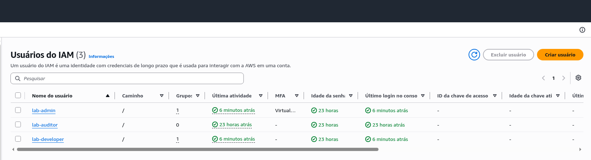

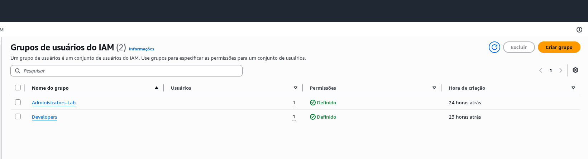

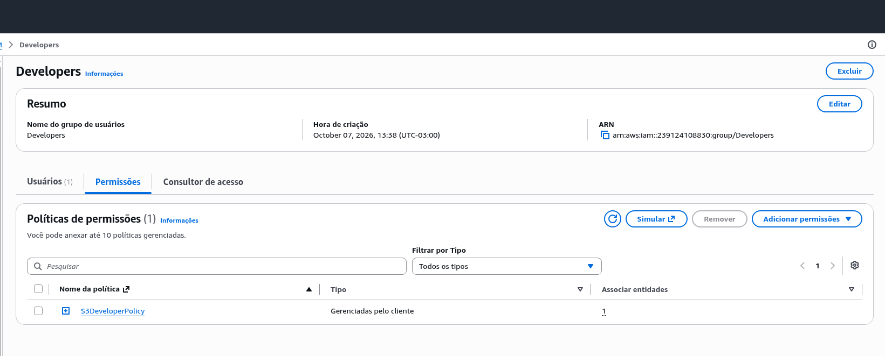

A política de acesso do desenvolvedor foi exportada para [`policies/S3DeveloperPolicy.json`](policies/S3DeveloperPolicy.json). Ela autoriza listagem de buckets na conta, consulta de região, listagem de objetos e leitura/gravação de objetos no bucket do laboratório. Não inclui `s3:DeleteObject`. A permissão `s3:PutObject` permite sobrescrever objetos existentes. A ausência de `DeleteObject` nesta política não garante uma negação caso outra política conceda a ação.


## 2. Autenticação multifator (MFA)

Foi verificado MFA habilitado nos três usuários IAM (`lab-admin`, `lab-developer` e `lab-auditor`) e na identidade root. Também foi observado que os usuários do laboratório não possuíam access keys configuradas.

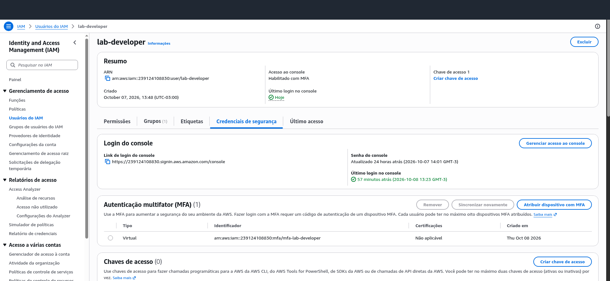

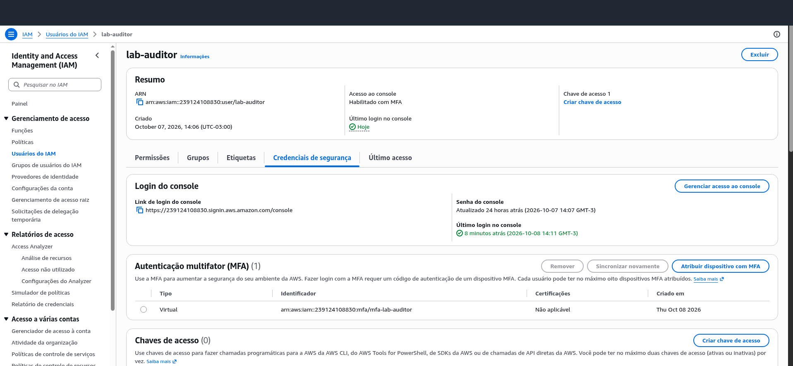

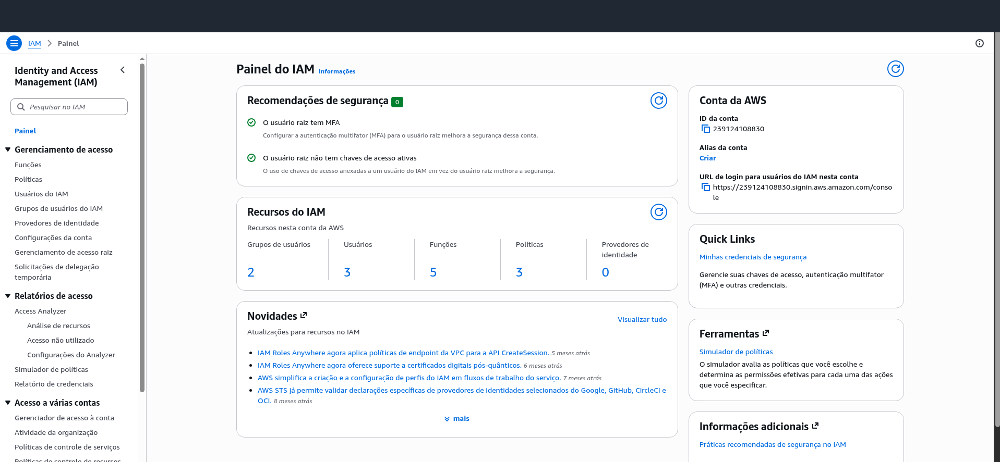

## 3. Armazenamento S3 e controle de acesso

Foi utilizado o bucket de testes `iam-security-lab-muller-2026`, contendo um objeto `test.txt` para validar o comportamento das permissões.

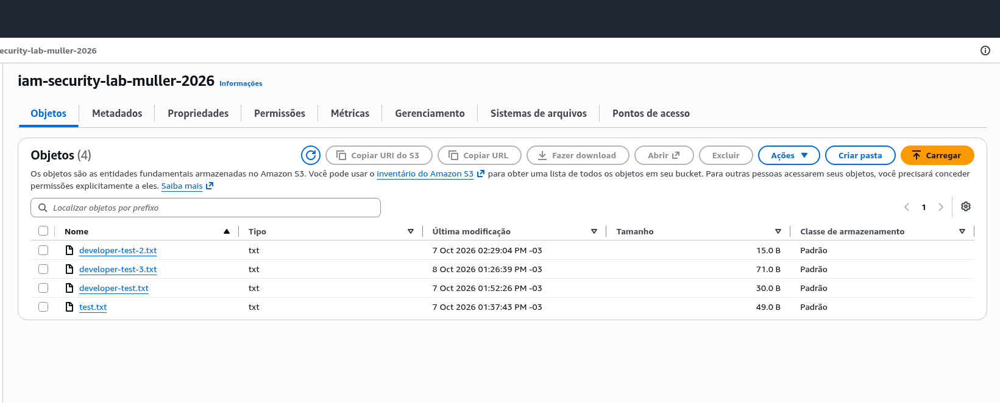

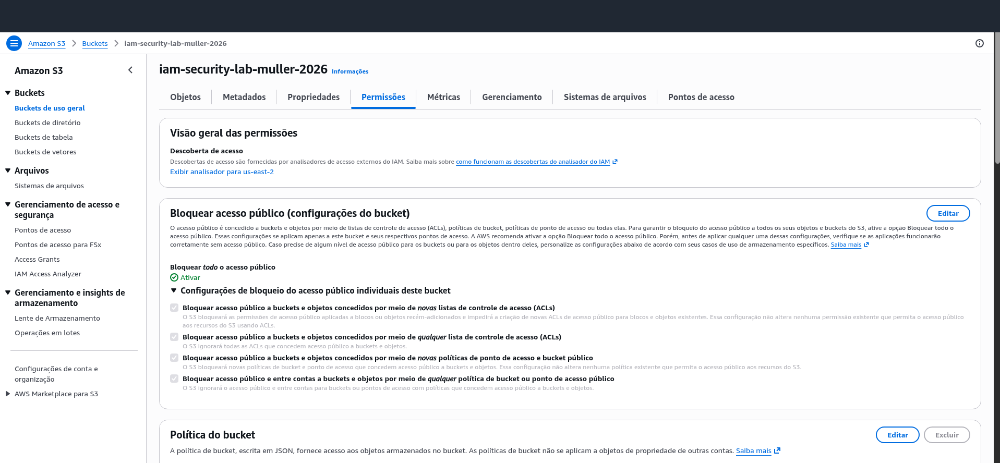

### Teste prático: identidade de auditoria

Ao utilizar `lab-auditor`, foi possível visualizar informações sobre buckets e objetos. Entretanto, as tentativas de acessar o conteúdo do objeto (`s3:GetObject`), enviar um objeto (`s3:PutObject`) e excluir um objeto (`s3:DeleteObject`) foram negadas.

A resposta de `GetObject` indicou ausência de uma política baseada em identidade que autorizasse a ação. Isso demonstra a diferença entre **listar metadados** e **ler o conteúdo** armazenado no S3.

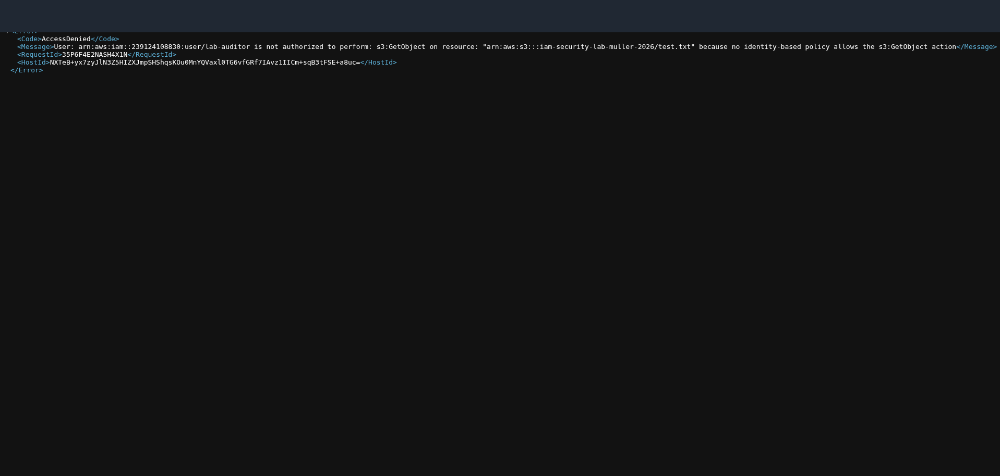

## 4. Validação no IAM Policy Simulator

O simulador foi usado para avaliar permissões dos perfis `lab-developer` e `lab-auditor`.

| Ação S3 | `lab-developer` | `lab-auditor` |
|---|---|---|
| `s3:ListBucket` | Allowed | Allowed |
| `s3:GetObject` | Allowed | Implicit Deny |
| `s3:PutObject` | Allowed | Implicit Deny |
| `s3:DeleteObject` | Implicit Deny | Implicit Deny |

Para `lab-auditor`, a ação `s3:ListAllMyBuckets` também foi avaliada como **Allowed**.

**Detalhe técnico:** `s3:ListBucket` deve ser avaliada com o ARN do bucket (`arn:aws:s3:::NOME_DO_BUCKET`), enquanto operações sobre objetos normalmente utilizam o ARN dos objetos (`arn:aws:s3:::NOME_DO_BUCKET/*`). A avaliação foi ajustada para usar o recurso correto.

> **Limitação:** os resultados acima são decisões do **Policy Simulator**. Os testes práticos de acesso negado descritos na seção anterior foram realizados com `lab-auditor`; não devem ser confundidos com execução real de todas as ações do desenvolvedor.

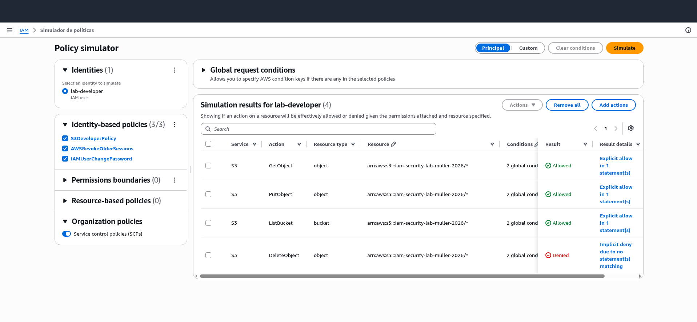

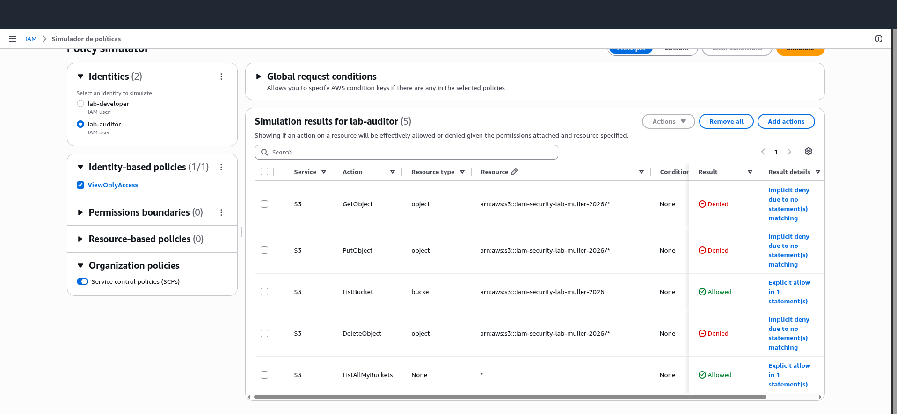

## 5. IAM Access Analyzer

Foi configurado um analisador de **acesso externo** chamado `iam-security-lab-analyzer`, na região **US East (Ohio)**.

Na consulta realizada, o analisador estava ativo e apresentava **zero descobertas ativas de acesso externo**.

Isso indica que o analisador não identificou descobertas externas ativas naquele momento. **Não significa** que todas as políticas IAM estejam corretas ou que o ambiente tenha sido integralmente auditado.

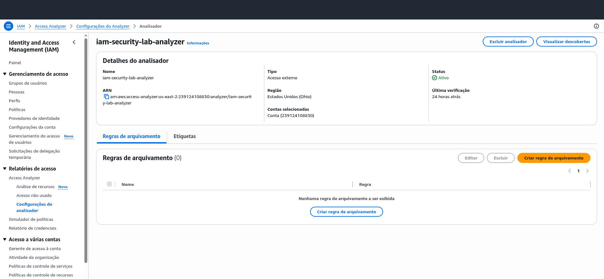

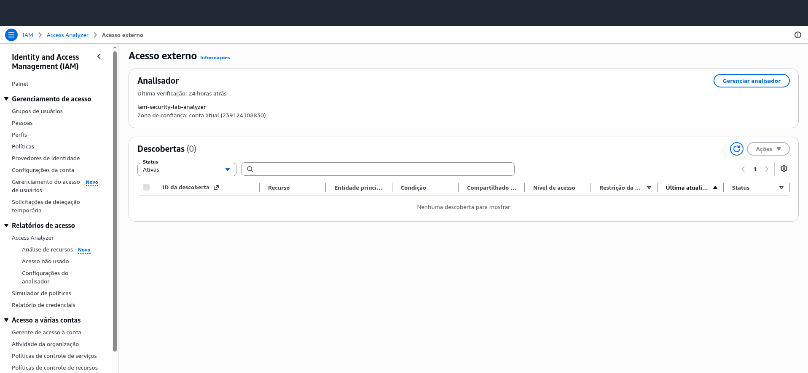

## 6. Governança de custos com AWS Budgets

Para acompanhar os gastos do laboratório, foi criado um orçamento de custo mensal de **US$ 1,00**, com três condições de alerta:

| Alerta | Condição |
|---|---|
| Gasto real de 85% | US$ 0,85 |
| Gasto real de 100% | US$ 1,00 |
| Gasto previsto de 100% | Previsão de US$ 1,00 |

Na verificação final, o orçamento estava **Íntegro**, o e-mail estava **Verified (1/1)** e o gasto exibido era **US$ 0,00**.

> **Importante:** um orçamento AWS Budgets **não desliga automaticamente os serviços** ao atingir o limite. Alertas e créditos promocionais também não substituem a revisão periódica da página de faturamento.

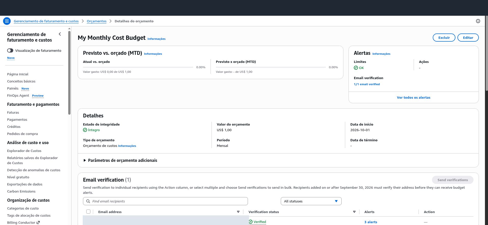

## 7. Resultados e aprendizados

O laboratório permitiu exercitar:

1. Separação de responsabilidades por usuários, grupos e políticas IAM.
2. Uso de MFA e redução da dependência de credenciais de acesso programático.
3. Diferença entre permissões para buckets e permissões para objetos S3.
4. Interpretação de decisões `Allowed` e `Implicit Deny`.
5. Validação de permissões com simulador e testes de acesso no console.
6. Interpretação correta dos resultados de acesso externo do IAM Access Analyzer.
7. Configuração de limites e notificações de orçamento para laboratórios em nuvem.

## 8. Organização das evidências

```text
screenshots/
├── 01-iam/
├── 02-mfa/
├── 03-s3/
├── 04-policy-simulator/
├── 05-access-analyzer/
└── 06-cost-management/
```

As imagens foram selecionadas a partir das capturas reais do laboratório. Informações pessoais foram parcialmente ocultadas. Antes de tornar o repositório público, revise as imagens novamente para evitar a divulgação de credenciais, tokens, e-mails ou dados que prefira manter privados.

## Próximas melhorias

- Revisar oportunidades de separar ações de bucket e objeto na política `S3DeveloperPolicy`.
- Avaliar restringir `s3:GetBucketLocation` ao bucket do laboratório.
- Reavaliar as permissões e documentar oportunidades de restrição adicional.
- Encerrar ou remover recursos de laboratório que não sejam mais necessários.

---

**Projeto educacional para portfólio de Cloud Security.**
